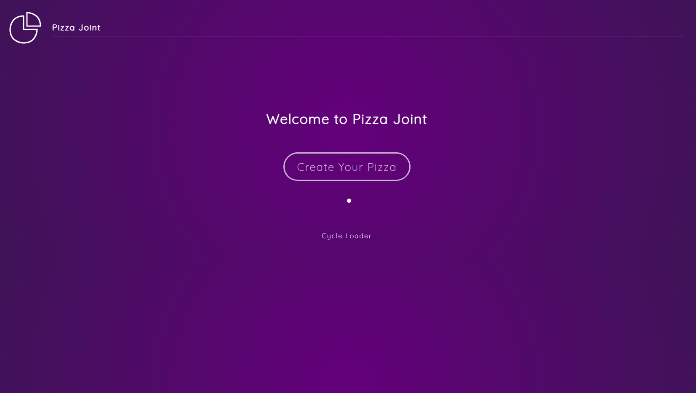
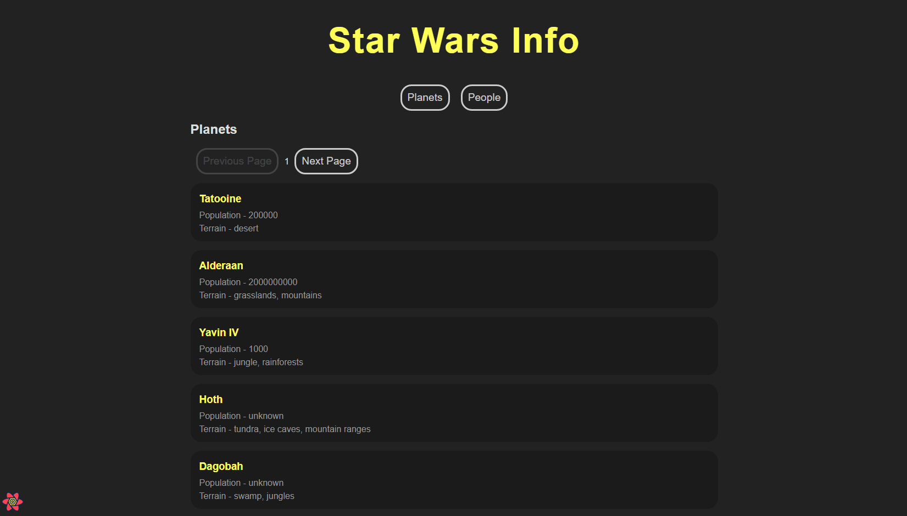
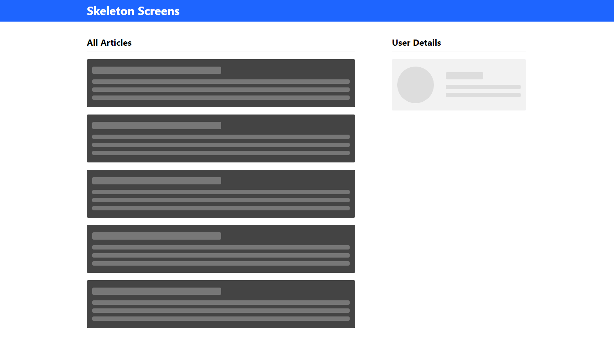

# React Projects

This repo is made of 4 projects:

1. [**Food Delivery App**](#food): A food delivery app to understand React Framer Motion basics.
2. [**Star Wars Info**](#starwars): A web app about Star Wars to understand React Query basics.
3. [**Skeleton Screens**](#skeleton): A small project to learn how to generate content placeholders with React.
4. [**Material Note**](#materialnote): A note-taking app to discover Material-UI framework.

## 1) Food Delivery App

A food delivery app to understand React Framer Motion basics.

[See food-delivery folder](https://github.com/solygambas/react-projects/tree/main/food-delivery)

    

### Features

- setting up a React project with Framer Motion.
- animating elements, handling initial animation state and transition options.
- creating hover animations with whileHover.
- structuring code and leveraging inheritance with variants.
- generating keyframes and repeating animations with yoyo.
- adding animations between screens with AnimatePresence.
- building a modal animation and playing with an inline SVG.
- making a loader and shifting between predefined animations with useCycle.
- enabling draggable elements with drag.

Based on [Framer Motion (for React)](https://www.youtube.com/watch?v=2V1WK-3HQNk&list=PL4cUxeGkcC9iHDnQfTHEVVceOEBsOf07i&index=1) by Shaun Pelling - The Net Ninja (2020).

## 2) Star Wars Info

A web app about Star Wars to understand React Query basics.

[See star-wars folder](https://github.com/solygambas/react-projects/tree/main/star-wars)

    

### Features

- setting up a React project with React Query 3.
- using QueryClientProvider as a wrapper.
- fetching data from Swapi with useQuery.
- handling query variables and pagination with keepPreviousData.
- debugging with React Query Devtools.

Based on [React Query Tutorial](https://www.youtube.com/watch?v=x1rQ61otgtU&list=PL4cUxeGkcC9jpi7Ptjl5b50p9gLjOFani) by Shaun Pelling - The Net Ninja (2020).

## 3) Skeleton Screens

A small project to learn how to generate content placeholders with React.

[See skeleton-screens folder](https://github.com/solygambas/react-projects/tree/main/skeleton-screens)

    

### Features

- fetching dummy data from JSON Placeholder API.
- creating and styling a base skeleton component for title, text, avatar and thumbnail.
- building a skeleton template for loading articles and loading profile.
- handling light and dark themes.
- adding a shimmer animation.

Based on [React Skeleton Screen Tutorial](https://www.youtube.com/watch?v=cg_tmJBisp8&list=PL4cUxeGkcC9i6bZhMuAzQpC6YgLmB4k4-) by Shaun Pelling - The Net Ninja (2020).

## 4) Material Note

A note-taking app to discover Material-UI framework.

[See material-note folder](https://github.com/solygambas/react-projects/tree/main/material-note)

    

### Features

- understanding Material-UI key components: Typography, Buttons and Icons.
- creating a custom theme and using makeStyles hook.
- generating a form to add new notes with text fields and radio buttons.
- using a local JSON Server to save, fetch and delete notes.
- working with the grid system and the Card component.
- building a layout with a permanent drawer, a menu list and an app bar.
- displaying avatars for the user and for each note category.
- styling the grid with React Masonry CSS.

Based on [Material UI Tutorial](https://www.youtube.com/watch?v=0KEpWHtG10M&list=PL4cUxeGkcC9gjxLvV4VEkZ6H6H4yWuS58) by Shaun Pelling - The Net Ninja (2021).
