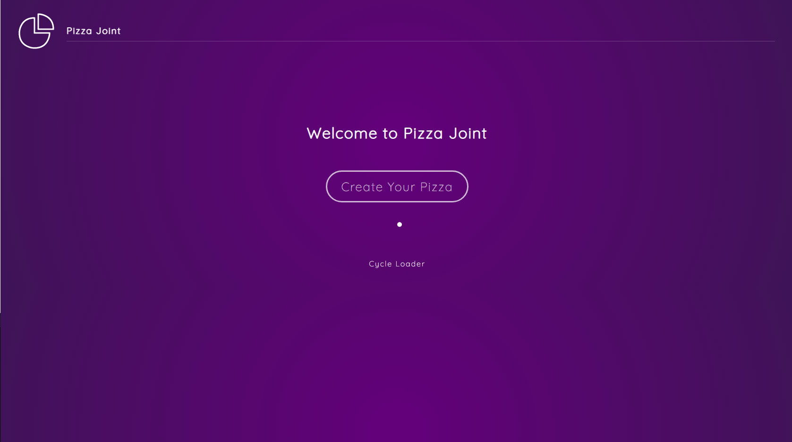

# Food Delivery App - React Framer Motion

A food delivery app to understand React Framer Motion basics.

    

## Features

- setting up a React project with Framer Motion.
- animating elements, handling initial animation state and transition options.
- creating hover animations with whileHover.
- structuring code and leveraging inheritance with variants.
- generating keyframes and repeating animations with yoyo.
- adding animations between screens with AnimatePresence.
- building a modal animation and playing with an inline SVG.
- making a loader and shifting between predefined animations with useCycle.
- enabling draggable elements with drag.

Based on [Framer Motion (for React)](https://www.youtube.com/watch?v=2V1WK-3HQNk&list=PL4cUxeGkcC9iHDnQfTHEVVceOEBsOf07i&index=1) by Shaun Pelling - The Net Ninja (2020).
