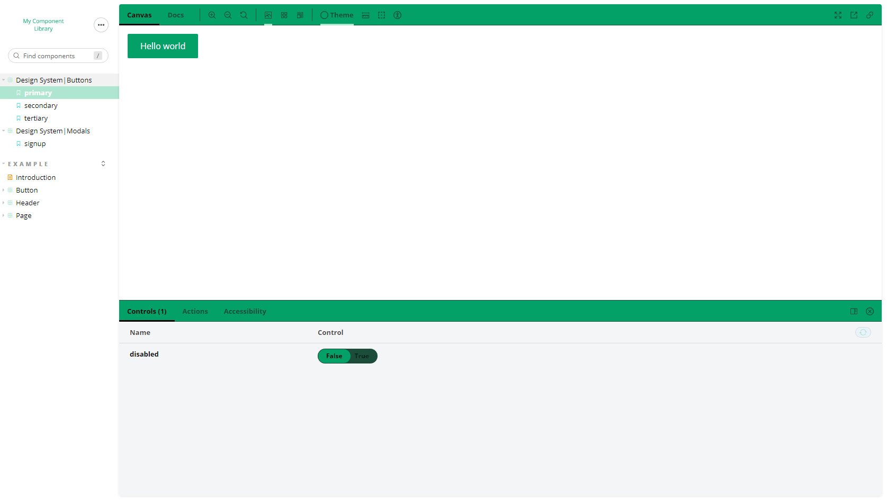

# React Projects

9 small React projects using React Query, React Framer Motion, React Spring, React Testing Library, Material-UI and Storybook.

| #   | Project                                       | Description                                                                           |
| --- | --------------------------------------------- | ------------------------------------------------------------------------------------- |
| 01  | [**Food Delivery App**](#food)                | A food delivery app to understand React Framer Motion basics.                         |
| 02  | [**Star Wars Info**](#starwars)               | A web app about Star Wars to understand React Query basics.                           |
| 03  | [**Skeleton Screens**](#skeleton)             | A small project to learn how to generate content placeholders with React.             |
| 04  | [**Material Note**](#materialnote)            | A note-taking app to discover Material-UI framework.                                  |
| 05  | [**Testing React App**](#testing)             | A simple project using React Testing Library.                                         |
| 06  | [**My Component Library**](#componentlibrary) | An introduction to design systems with styled-components, React Spring and Storybook. |
| 07  | [**Taskbox**](#taskbox)                       | A quick intro to learn to create UI components with React and Storybook.              |
| 08  | [**Design System**](#designsystem)            | A tutorial to learn how to build design systems.                                      |
| 09  | [**Microfrontends**](#microfrontends)         | A microfrontend architecture using React, Vue and Webpack.                            |

## 1) Food Delivery App

A food delivery app to understand React Framer Motion basics.

[See food-delivery folder](food-delivery)

    

### Features

- setting up a React project with Framer Motion.
- animating elements, handling initial animation state and transition options.
- creating hover animations with whileHover.
- structuring code and leveraging inheritance with variants.
- generating keyframes and repeating animations with yoyo.
- adding animations between screens with AnimatePresence.
- building a modal animation and playing with an inline SVG.
- making a loader and shifting between predefined animations with useCycle.
- enabling draggable elements with drag.

Based on [Framer Motion (for React)](https://www.youtube.com/watch?v=2V1WK-3HQNk&list=PL4cUxeGkcC9iHDnQfTHEVVceOEBsOf07i&index=1) by Shaun Pelling - The Net Ninja (2020).

## 2) Star Wars Info

A web app about Star Wars to understand React Query basics.

[See star-wars folder](star-wars)

    

### Features

- setting up a React project with React Query 3.
- using QueryClientProvider as a wrapper.
- fetching data from Swapi with useQuery.
- handling query variables and pagination with keepPreviousData.
- debugging with React Query Devtools.

Based on [React Query Tutorial](https://www.youtube.com/watch?v=x1rQ61otgtU&list=PL4cUxeGkcC9jpi7Ptjl5b50p9gLjOFani) by Shaun Pelling - The Net Ninja (2020).

## 3) Skeleton Screens

A small project to learn how to generate content placeholders with React.

[See skeleton-screens folder](skeleton-screens)

    

### Features

- fetching dummy data from JSON Placeholder API.
- creating and styling a base skeleton component for title, text, avatar and thumbnail.
- building a skeleton template for loading articles and loading profile.
- handling light and dark themes.
- adding a shimmer animation.

Based on [React Skeleton Screen Tutorial](https://www.youtube.com/watch?v=cg_tmJBisp8&list=PL4cUxeGkcC9i6bZhMuAzQpC6YgLmB4k4-) by Shaun Pelling - The Net Ninja (2020).

## 4) Material Note

A note-taking app to discover Material-UI framework.

[See material-note folder](material-note)

    

### Features

- understanding Material-UI key components: Typography, Buttons and Icons.
- creating a custom theme and using makeStyles hook.
- generating a form to add new notes with text fields and radio buttons.
- using a local JSON Server to save, fetch and delete notes.
- working with the grid system and the Card component.
- building a layout with a permanent drawer, a menu list and an app bar.
- displaying avatars for the user and for each note category.
- styling the grid with React Masonry CSS.
- migrating from Material-UI v4 to v5.
- customizing Material-UI components with styled.

Based on [Material UI Tutorial](https://www.youtube.com/watch?v=0KEpWHtG10M&list=PL4cUxeGkcC9gjxLvV4VEkZ6H6H4yWuS58) by Shaun Pelling - The Net Ninja (2021).

## 5) Testing React App

A simple project using React Testing Library.

[See testing-react-app folder](testing-react-app)

    

### Features

- setting up tests with React Testing Library.
- understanding differences between query methods: getBy, findBy, queryBy, getAllBy, findAllBy, queryAllBy.
- using attributes by priority to mimic user behavior.
- exploring assertions and organizing tests blocks with describe.
- triggering events with fireEvent.
- creating integration tests on a parent component.
- mocking external requests and finding async elements.
- using beforeEach, beforeAll, afterEach and afterAll hooks.

Based on [React Testing Library Tutorial](https://www.youtube.com/playlist?list=PL4cUxeGkcC9gm4_-5UsNmLqMosM-dzuvQ) by
Laith Harb for The Net Ninja (2021).

## 6) My Component Library

An introduction to design systems with styled-components, React Spring and Storybook.

[See my-component-library folder](my-component-library)

[See demo deployed on Vercel](https://my-component-library.vercel.app/)

    

### Features

- creating a design system in Figma for colors, typography and buttons.
- setting up a custom theme and building buttons with styled-components.
- handling button variations with styled-components-modifiers.
- using a theme provider to enable dark mode.
- building and animating a modal with React Spring.
- documenting components, adding controls and handling actions with Storybook.
- using decorators and creating a context to provide our theme.
- testing accessibility with @storybook/addon-a11y.
- customizing Storybook theme with @storybook/addons and @storybook/theming.
- deploying on Netlify.

Based on [Design Systems with Storybook & React](https://frontendmasters.com/workshops/design-systems-storybook/) by
Emma Bostian (2020).

## 7) Taskbox

A quick intro to learn to create UI components with React and Storybook.

[See taskbox folder](taskbox)

[See demo deployed on Chromatic](https://main--634d833943e511bf6506f771.chromatic.com/)

    

### Features

- setting up Storybook with React.
- building a simple Task component in isolation.
- catching accessibility issues.
- assembling a composite TaskList component.
- learning how to wire in data with Redux.
- constructing a screen with a remote API.
- mocking API services with Mock Service Worker.
- writing an interaction test.
- deploying on Chromatic.
- testing UI components.
- using the Controls addon.

Based on [Storybook for React tutorial](https://storybook.js.org/tutorials/intro-to-storybook/react/en/get-started/) by Chromatic (2022).

## 8) Design System

A tutorial to learn how to build design systems.

[See design-system folder](design-system)

[See demo deployed on Chromatic](https://main--634fb5a44afef8aae1b84965.chromatic.com/)

[See package published on NPM](https://www.npmjs.com/package/@solygambas/learnstorybook-design-system)

  

### Features

- setting up Storybook to build and catalog design system components.
- collaborating with continuous integration and visual review on Chromatic.
- testing design system appearance, functionality, and accessibility.
- driving design system adoption with MDX documentation.
- packaging and importing a design system into other apps.
- adding a new component AvatarList to repeat the workflow.

Based on [Design Systems for Developers tutorial](https://storybook.js.org/tutorials/design-systems-for-developers/) by Dominic Nguyen and Tom Coleman (2022).

## 9) Microfrontends

A microfrontend architecture using React, Vue and Webpack.

### Ecommerce

A small project to understand the basics of microfrontends.

[See microfrontends/01-ecommerce folder](microfrontends/01-ecommerce)

#### Features

- understanding build-time and run-time integrations.
- setting up Webpack.
- generating products with Faker.
- scaffolding the container.
- implementing module federation.
- scaffolding the cart.
- using shared modules.
- consuming remote modules.

## SaaS

A project to learn to link React and Vue apps together.

[See microfrontends/02-saas folder](microfrontends/02-saas)

### Features

- choosing a architecture based on requirements.
- setting up Webpack for development and production.
- creating and merging development config.
- wiring up React.
- assembling the App component and the Container.
- integrating the Marketing App with the mount function.
- delegating shared module selection.
- implementing a CICD pipeline with GitHub Actions.
- setting up a S3 bucket, configuring Cloudfront and deploying to AWS.
- creating and assigning access keys.
- automating cache invalidation.
- handling CSS in microfrontends.
- implementing multi-tier navigation.
- using memory history and syncing history objects.
- creating the Auth app, adding signin and signup forms.

Based on [Microfrontends with React: A Complete Developer's Guide](https://www.udemy.com/course/microfrontend-course/) by Stephen Grider (2021).
