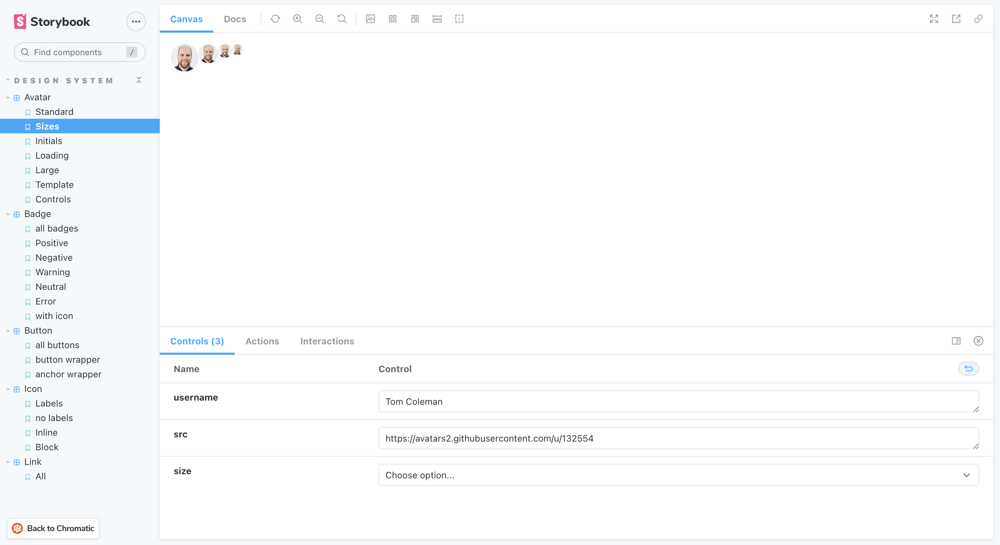

# Design System

A tutorial to learn how to build design systems.

[See demo deployed on Chromatic](https://634fb5a44afef8aae1b84965-cmykjnfptl.chromatic.com/)

  

## Features

- setting up Storybook to build and catalog design system components.
- collaborating with continuous integration and visual review on Chromatic.
- testing design system appearance, functionality, and accessibility.

Based on [Design Systems for Developers tutorial](https://storybook.js.org/tutorials/design-systems-for-developers/) (2022).
