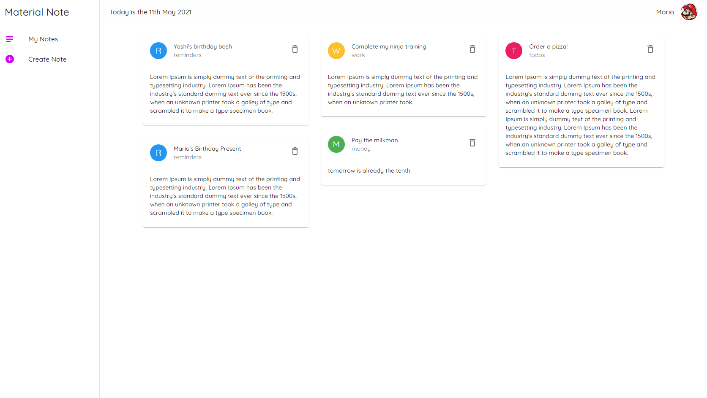

# Material Note

A note-taking app to discover Material-UI framework.

        

## Features

- understanding Material-UI key components: Typography, Buttons and Icons.
- creating a custom theme and using makeStyles hook.
- generating a form to add new notes with text fields and radio buttons.
- using a local JSON Server to save, fetch and delete notes.
- working with the grid system and the Card component.
- building a layout with a permanent drawer, a menu list and an app bar.
- displaying avatars for the user and for each note category.
- styling the grid with React Masonry CSS.

Based on [Material UI Tutorial](https://www.youtube.com/watch?v=0KEpWHtG10M&list=PL4cUxeGkcC9gjxLvV4VEkZ6H6H4yWuS58) by Shaun Pelling - The Net Ninja (2021).
