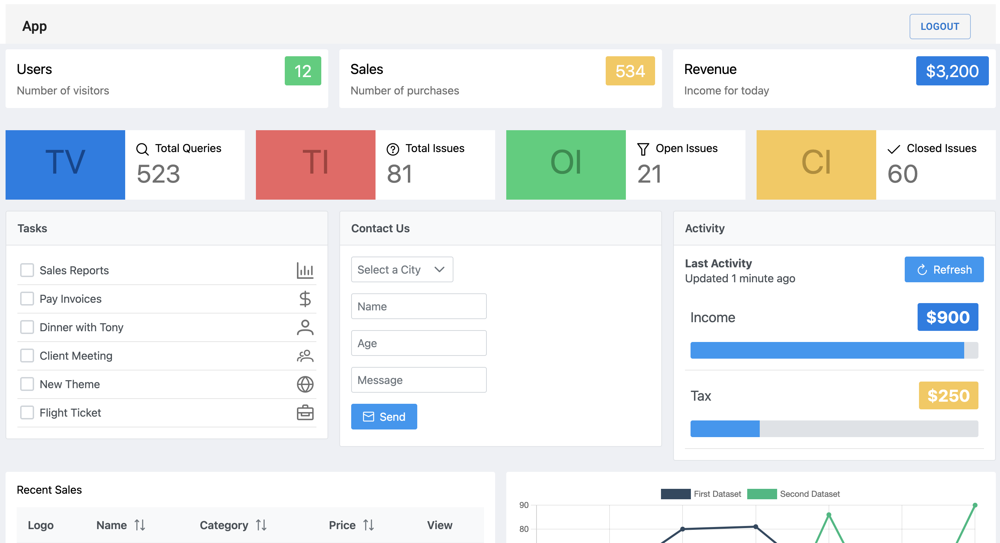

# SaaS

A project to learn to link React and Vue apps together.

        

## Features

- choosing an architecture based on requirements.
- setting up Webpack for development and production.
- creating and merging development config.
- wiring up React.
- assembling the App component and the Container.
- integrating the Marketing App with the mount function.
- delegating shared module selection.
- implementing a CICD pipeline with GitHub Actions.
- setting up a S3 bucket, configuring Cloudfront and deploying to AWS.
- creating and assigning access keys.
- automating cache invalidation.
- handling CSS in microfrontends.
- implementing multi-tier navigation.
- using memory history and syncing history objects.
- creating the Auth app, adding signin and signup forms.
- integrating Auth into the Container.
- adding a loading bar and lazily loading subapps.
- communicating Auth changes.
- allowing signout.
- setting up a Vue dashboard.
- protecting access to the dashboard.

Based on [Microfrontends with React: A Complete Developer's Guide](https://www.udemy.com/course/microfrontend-course/) by Stephen Grider (2021).
