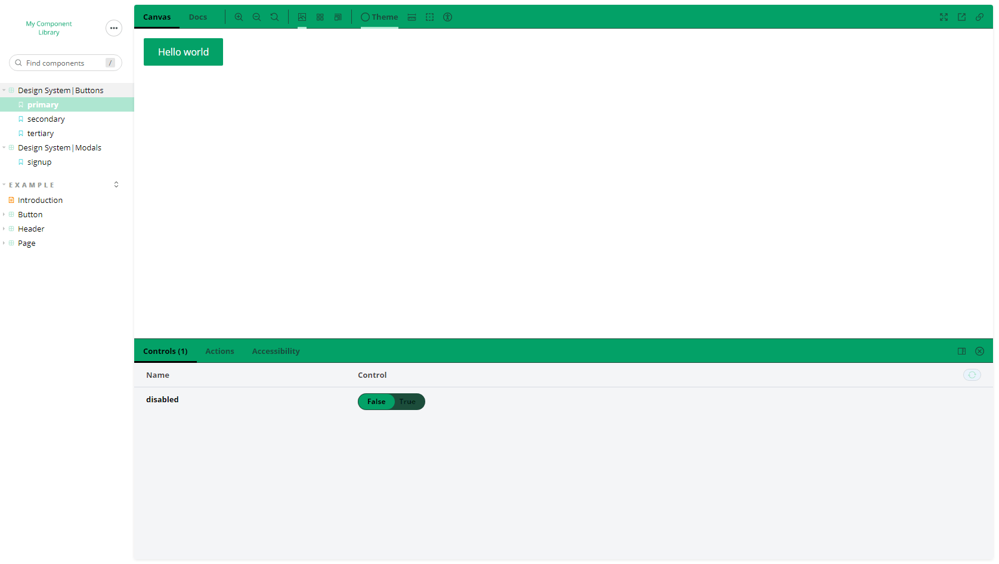

# My Component Library

An introduction to design systems with styled-components, React Spring and Storybook.

        

## Features

- creating a design system in Figma for colors, typography and buttons.
- setting up a custom theme and building buttons with styled-components.
- handling button variations with styled-components-modifiers.
- using a theme provider to enable dark mode.
- building and animating a modal with React Spring.
- documenting components, adding controls and handling actions with Storybook.
- using decorators and creating a context to provide our theme.
- testing accessibility with @storybook/addon-a11y.
- customizing Storybook theme with @storybook/addons and @storybook/theming.
- deploying on Netlify.

Based on [Design Systems with Storybook & React](https://frontendmasters.com/workshops/design-systems-storybook/) by
Emma Bostian (2020).
