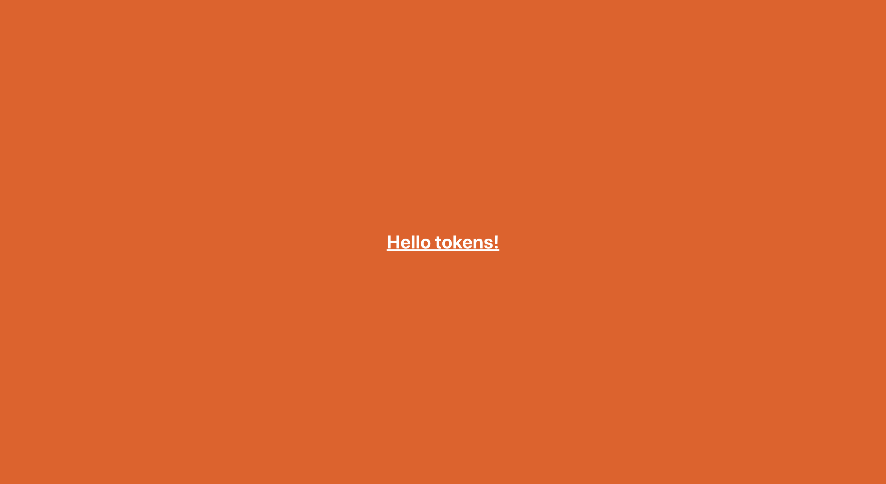

# Tailwind and Design Tokens

This Tailwind app serves to test the delivery of design tokens from another repo via GitHub Actions.

    

## Features

- consuming design tokens exported by Style Dictionary.
- setting up a React app with Tailwind.
- converting the tokens to a Tailwind Theme.

[See Main Repo](https://github.com/solygambas/figma-plugins)
