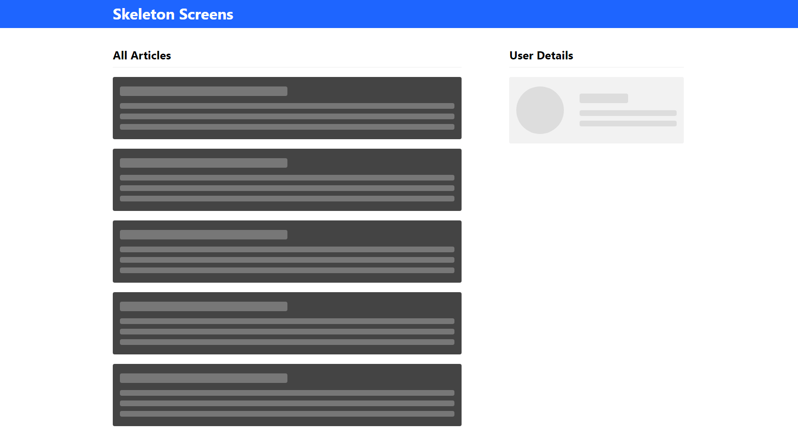

# Skeleton Screens

A small project to learn how to generate content placeholders with React.

    <!--  -->

## Features

-

Based on [React Skeleton Screen Tutorial](https://www.youtube.com/watch?v=cg_tmJBisp8&list=PL4cUxeGkcC9i6bZhMuAzQpC6YgLmB4k4-) by Shaun Pelling - The Net Ninja (2020).
